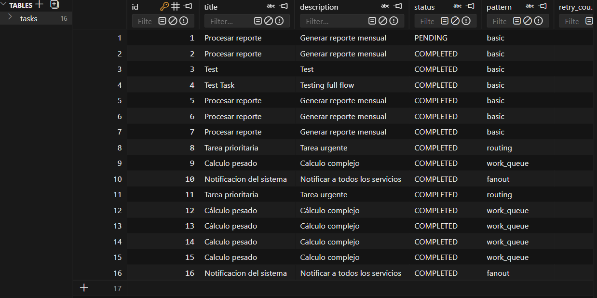

# FastAPI RabbitMQ all

Una aplicación integral con FastAPI que demuestra múltiples patrones de mensajería RabbitMQ con SQLAlchemy (SQLite), seguimiento de tareas, lógica de reintentos y cola de mensajes fallidos (DLQ).


<p align="center">
  
</p>


## Características

- **4 Patrones RabbitMQ**
  - **Cola Básica**: Entrega simple punto a punto
  - **Colas de Trabajo (Consumidores Competitivos)**: Distribuye tareas entre múltiples workers
  - **Pub/Sub (Exchange Fanout)**: Transmite mensajes a todos los suscriptores
  - **Enrutamiento (Exchange Topic)**: Enruta mensajes según claves de enrutamiento

- **API de Gestión de Tareas** (CRUD)
  - Crear tareas con título, descripción y selección de patrón
  - Listar tareas con paginación y filtro por estado
  - Obtener detalles y estado en tiempo real
  - Actualizar y eliminar tareas

- **Características de Producción**
  - Persistencia y durabilidad de mensajes
  - Confirmación manual (auto-ack desactivado)
  - Reintentos con backoff exponencial (hasta 3 reintentos)
  - Cola de mensajes fallidos (DLQ)
  - Seguimiento de estado (pendiente → procesando → completado/fallido)
  - Control de prefetch para distribución justa

## Requisitos

- **Python** 3.11+
- **Docker** (para RabbitMQ)
- **uv** (gestor de paquetes Python) o pip

## Inicio Rápido

### 1. Iniciar RabbitMQ

```bash
docker run -d --name mi-rabbitmq -p 5672:5672 -p 15672:15672 rabbitmq:3-management
```

Interfaz de gestión RabbitMQ: http://localhost:15672 (guest/guest)

### 2. Instalar Dependencias

```bash
uv sync
```

O con pip:

```bash
pip install -e .
```

### 3. Iniciar el Servidor API

```bash
uv run python main.py
```

La API estará disponible en http://localhost:8000
Documentación interactiva en http://localhost:8000/docs

### 4. Iniciar Workers (en una terminal separada)

```bash
uv run python workers/run_workers.py
```

## Uso de la API

### Crear una Tarea (PowerShell)

**Nota**: En PowerShell 5.1 usa `Invoke-RestMethod` con una variable hashtable para evitar errores con caracteres especiales:

```powershell
# Patrón básico
$body = @{title="Procesar reporte"; description="Generar reporte mensual"; pattern="basic"} | ConvertTo-Json
Invoke-RestMethod -Uri "http://localhost:8000/tasks" -Method Post -Body $body -ContentType "application/json"

# Patrón de cola de trabajo
$body = @{title="Calculo pesado"; description="Calculo complejo"; pattern="work_queue"} | ConvertTo-Json
Invoke-RestMethod -Uri "http://localhost:8000/tasks" -Method Post -Body $body -ContentType "application/json"

# Patrón fanout (transmisión a todos)
$body = @{title="Notificacion del sistema"; description="Notificar a todos los servicios"; pattern="fanout"} | ConvertTo-Json
Invoke-RestMethod -Uri "http://localhost:8000/tasks" -Method Post -Body $body -ContentType "application/json"

# Patrón de enrutamiento (topic exchange)
$body = @{title="Tarea prioritaria"; description="Tarea urgente"; pattern="routing"} | ConvertTo-Json
Invoke-RestMethod -Uri "http://localhost:8000/tasks" -Method Post -Body $body -ContentType "application/json"
```

### Listar Tareas

```powershell
Invoke-RestMethod -Uri "http://localhost:8000/tasks?page=1&page_size=20"
```

### Obtener Estado de Tarea

```powershell
Invoke-RestMethod -Uri "http://localhost:8000/tasks/1/status"
```

## Arquitectura RabbitMQ

### Exchanges
| Nombre | Tipo | Propósito |
|---|---|---|
| `tasks.direct` | direct | Patrones básico y cola de trabajo |
| `tasks.fanout` | fanout | Transmisión Pub/Sub |
| `tasks.topic` | topic | Enrutamiento con comodines |
| `tasks.dlx` | direct | Exchange de mensajes fallidos |

### Colas
| Nombre | Vinculada a | Clave de Enrutamiento | Propósito |
|---|---|---|---|
| `tasks.basic` | tasks.direct | `task.basic` | Cola simple |
| `tasks.work_queue` | tasks.direct | `task.work_queue` | Consumidores competitivos |
| `tasks.pubsub` | tasks.fanout | `""` | Transmisión fanout |
| `tasks.routing` | tasks.topic | `task.*` | Enrutamiento por tópico |
| `tasks.dlq` | tasks.dlx | `dlq` | Manejo de mensajes fallidos |

## Estructura del Proyecto

```
fastapirabbitmqt/
├── main.py                     # App FastAPI con ciclo de vida
├── config.py                   # Configuración via pydantic-settings
├── database/
│   ├── __init__.py
│   ├── session.py              # Motor SQLAlchemy y sesión
│   └── models.py               # Modelo Task con enum de estado
├── schemas/
│   ├── __init__.py
│   └── task.py                 # Esquemas Pydantic de solicitud/respuesta
├── rabbitmq/
│   ├── __init__.py
│   ├── connection.py           # Gestor de conexión singleton
│   ├── exchanges.py            # Configuración de infraestructura
│   ├── producer.py             # Publicador de mensajes
│   ├── consumer.py             # Consumidor base con reintentos/DLQ
│   ├── dlq.py                  # Consumidor de cola de mensajes fallidos
│   └── workers/
│       ├── __init__.py
│       ├── basic_worker.py     # Consumidor de cola básica
│       ├── work_queue_worker.py # Consumidor competitivo
│       ├── pubsub_worker.py    # Suscriptor fanout
│       └── routing_worker.py   # Consumidor de enrutamiento por tópico
├── services/
│   ├── __init__.py
│   └── task_service.py         # Capa de lógica de negocio
├── api/
│   ├── __init__.py
│   ├── deps.py                 # Dependencias FastAPI
│   └── routes/
│       ├── __init__.py
│       └── tasks.py            # Endpoints REST
└── workers/
    ├── __init__.py
    └── run_workers.py          # Lanzador de todos los consumidores
```

## Configuración

Copia `.env.example` o define variables de entorno:


```
DATABASE_URL=sqlite:///./tasks.db
RABBITMQ_HOST=localhost
RABBITMQ_PORT=5672
RABBITMQ_USER=guest
RABBITMQ_PASSWORD=guest
MAX_RETRIES=3
RETRY_DELAY_BASE=2.0
WORKER_PREFETCH_COUNT=1
```


| Variable | Default | Descripción |
|---|---|---|
| `DATABASE_URL` | `sqlite:///./tasks.db` | Conexión a base de datos |
| `RABBITMQ_HOST` | `localhost` | Servidor RabbitMQ |
| `RABBITMQ_PORT` | `5672` | Puerto AMQP |
| `RABBITMQ_USER` | `guest` | Usuario RabbitMQ |
| `RABBITMQ_PASSWORD` | `guest` | Contraseña RabbitMQ |
| `MAX_RETRIES` | `3` | Máximo de reintentos antes de DLQ |
| `RETRY_DELAY_BASE` | `2.0` | Retardo base para backoff exponencial |
| `WORKER_PREFETCH_COUNT` | `1` | Cantidad de prefetch por consumidor |


### 📄 License

This project is licensed under the MIT License - see the [LICENSE](LICENSE) file for details.

---

## 👨‍💻 Author / Autor

**Diego Ivan Perea Montealegre**

- GitHub: [@diegoperea20](https://github.com/diegoperea20)

---

Created by [Diego Ivan Perea Montealegre](https://github.com/diegoperea20)