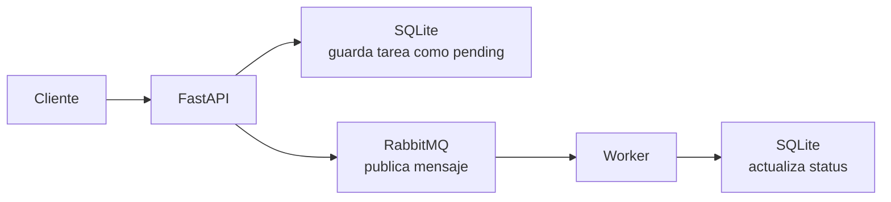
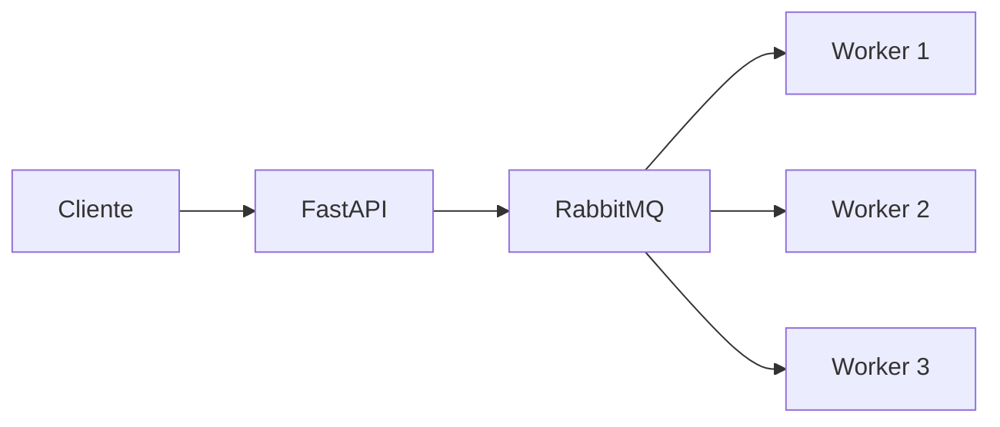
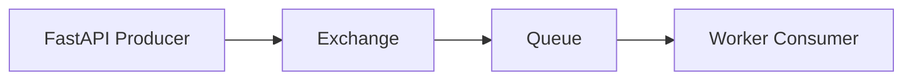
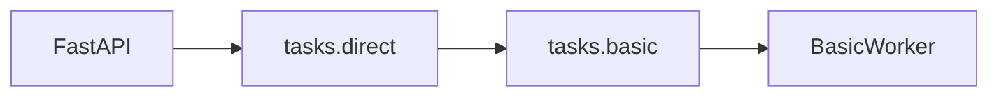
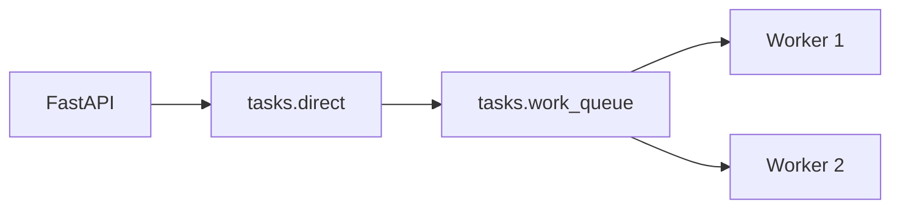
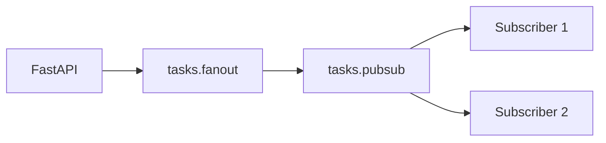
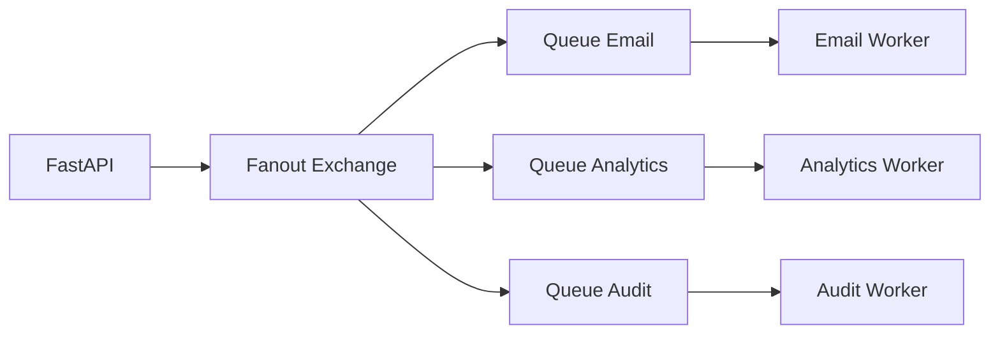
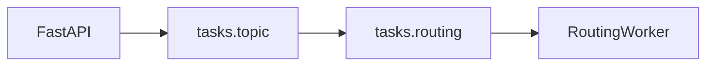
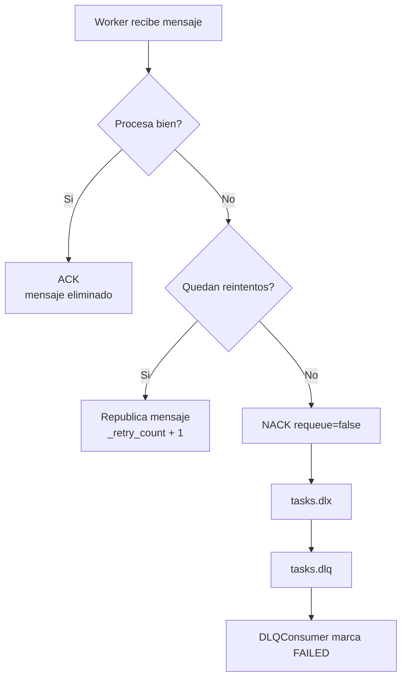

# Explicacion del proyecto FastAPI + RabbitMQ

Este proyecto es una API hecha con **FastAPI** que crea tareas y las manda a **RabbitMQ** para que otros procesos, llamados **workers**, las procesen en segundo plano.

La idea principal es separar la recepcion de una tarea del procesamiento pesado de esa tarea.

```text
Cliente -> API -> guardar tarea -> enviar mensaje -> worker procesa despues
```

En vez de hacer todo directamente dentro del request HTTP, la API guarda la tarea, publica un mensaje en RabbitMQ y responde rapido.

---

## Flujo general

Cuando haces una peticion:

```http
POST /tasks
```

la API no procesa la tarea pesada inmediatamente. Hace esto:



Ejemplo: si una tarea tarda 10 segundos en generar un reporte, la API no deja esperando al usuario esos 10 segundos. Solo registra la tarea, la manda a RabbitMQ, y responde rapido.

Luego un worker toma el mensaje y cambia el estado:

```text
pending -> processing -> completed
```

Si falla:

```text
processing -> retry -> retry -> retry -> failed
```

---

## Que diferencia hay con hacerlo normal

### Forma normal, sin RabbitMQ


Problemas:

- El cliente espera hasta que termine.
- Si la tarea falla, el request falla.
- Si hay muchas tareas, la API se bloquea mas facil.
- Escalar es mas dificil porque la API hace todo.

### Forma con RabbitMQ



Ventajas:

- La API responde rapido.
- Puedes tener muchos workers procesando en paralelo.
- Si un worker cae, los mensajes pueden seguir en la cola.
- Puedes reintentar tareas fallidas.
- Puedes mandar diferentes tipos de tareas a diferentes workers.
- Puedes usar una DLQ, una cola especial para mensajes que fallaron demasiado.

RabbitMQ funciona como una oficina de correos: la API deja "cartas" en RabbitMQ, y los workers las recogen cuando pueden.

---

## Partes importantes del proyecto

La API esta principalmente en:

```text
main.py
api/routes/tasks.py
services/task_service.py
```

El flujo principal esta en:

```text
TaskService.create_task()
```

Ese metodo:

1. Guarda la tarea en SQLite.
2. Publica un mensaje en RabbitMQ segun el patron elegido.

RabbitMQ esta dividido en:

```text
rabbitmq/connection.py   -> conexion a RabbitMQ
rabbitmq/exchanges.py    -> declara exchanges, queues y bindings
rabbitmq/producer.py     -> publica mensajes
rabbitmq/consumer.py     -> logica base de consumo, retry y DLQ
rabbitmq/dlq.py          -> procesa mensajes muertos
rabbitmq/workers/        -> workers concretos
```

Los workers se levantan con:

```bash
uv run python workers/run_workers.py
```

---

## Conceptos clave de RabbitMQ

RabbitMQ tiene 4 piezas importantes:

```text
Producer -> Exchange -> Queue -> Consumer
```

En este proyecto:

- **Producer**: la API, usando `TaskProducer`.
- **Exchange**: decide a que cola va el mensaje.
- **Queue**: almacena mensajes esperando procesamiento.
- **Consumer**: worker que consume mensajes.

Diagrama:



La API normalmente no manda el mensaje directo a una cola. Lo manda a un exchange, y el exchange decide a que queue enviarlo.

---

## Patron 1: Basic

El patron **basic** es el mas simple.



La API publica con routing key:

```text
task.basic
```

RabbitMQ lo manda a la cola:

```text
tasks.basic
```

Y un solo worker lo procesa.

Ejemplo cotidiano:

```text
Tengo una caja de pendientes y una persona que los resuelve uno por uno.
```

Util para:

- Procesos simples.
- Demostraciones.
- Una sola clase de tarea.
- Cuando no necesitas paralelismo complejo.

---

## Patron 2: Work Queue

**Work queue** usa una cola compartida entre varios workers.



Aqui varios workers compiten por mensajes de la misma cola.

Si llegan 10 tareas:

```text
Worker 1 procesa tarea 1
Worker 2 procesa tarea 2
Worker 1 procesa tarea 3
Worker 2 procesa tarea 4
...
```

Cada tarea la procesa solo un worker.

Ejemplo cotidiano:

```text
Una fila de clientes y varios cajeros. Cada cliente lo atiende un solo cajero.
```

Util para:

- Procesamiento paralelo.
- Tareas pesadas.
- Escalar agregando mas workers.
- Distribuir carga.

En este proyecto hay dos workers de work queue:

```text
work_queue_worker_1
work_queue_worker_2
```

---

## Patron 3: Fanout / PubSub

**Fanout** envia el mismo mensaje a todos los consumidores conectados a colas vinculadas al exchange.



Conceptualmente, fanout significa **broadcast**.

Ejemplo cotidiano:

```text
Un anuncio por altavoz. Todos los departamentos lo escuchan.
```

Util para:

- Notificaciones.
- Logs.
- Eventos que varios sistemas deben recibir.
- "Cuando pase X, avisale a todos".

Importante: para pub/sub real, normalmente cada subscriber tendria su propia cola. En este proyecto hay una cola `tasks.pubsub`; con varios workers sobre la misma cola, compiten por mensajes. La idea del exchange fanout esta demostrada, pero un pub/sub puro suele verse asi:



Ahi si todos reciben copia del mismo mensaje.

---

## Patron 4: Routing / Topic

**Routing** usa reglas para decidir que mensajes van a que colas.



En este proyecto la cola `tasks.routing` esta enlazada con:

```text
task.*
```

Eso significa:

```text
task.email       -> entra
task.report      -> entra
task.anything    -> entra
task.high.email  -> no entra con task.*
```

En RabbitMQ topic:

```text
* = una palabra
# = cero o mas palabras
```

Ejemplos:

```text
task.*       -> task.email, task.report
task.high.*  -> task.high.email, task.high.report
task.#       -> task.email, task.high.email, task.high.priority.report
```

Ejemplo cotidiano:

```text
Una oficina clasifica documentos segun etiquetas:
task.report, task.email, task.high.invoice.
```

Util para:

- Prioridades.
- Categorias.
- Multiples tipos de eventos.
- Enviar mensajes solo a workers interesados.

---

## Retry y DLQ

El proyecto tiene reintentos automaticos.

Si un worker falla procesando una tarea:



RabbitMQ maneja esto con:

```text
tasks.dlx -> Dead Letter Exchange
tasks.dlq -> Dead Letter Queue
```

DLQ significa **Dead Letter Queue**, o cola de mensajes muertos. No significa que desaparecen, sino que van a una cola especial para tareas que ya fallaron demasiadas veces.

Ejemplo facil:

```text
Si una tarea falla 3 veces, ya no se sigue intentando.
Se manda a una bandeja de "fallidos" para revisarla despues.
```

---

## Resumen de los 4 modos

| Patron | Que hace | Ejemplo simple |
|---|---|---|
| Basic | Una cola, un worker principal | Una persona procesa una lista |
| Work Queue | Una cola, varios workers compiten | Varios cajeros atienden una fila |
| Fanout | Broadcast a todos los interesados | Anuncio para todos |
| Routing / Topic | Envia segun reglas o etiquetas | Clasificar tareas por categoria |

---

## Ejemplos de uso mental

### Tarea basic

```json
{
  "title": "Generar reporte",
  "pattern": "basic"
}
```

Flujo:

```text
tasks.direct -> tasks.basic -> BasicWorker
```

### Tarea work queue

```json
{
  "title": "Procesar 100 imagenes",
  "pattern": "work_queue"
}
```

Flujo:

```text
tasks.direct -> tasks.work_queue -> Worker disponible
```

### Tarea pubsub

```json
{
  "title": "Notificar evento global",
  "pattern": "pubsub"
}
```

Flujo:

```text
tasks.fanout -> colas vinculadas
```

### Tarea routing

```json
{
  "title": "Procesar tarea con routing",
  "pattern": "routing"
}
```

Flujo:

```text
tasks.topic -> tasks.routing -> RoutingWorker
```

---

## Resumen final

La forma mas sencilla de entender este proyecto es:

```text
FastAPI recibe y registra tareas.
RabbitMQ decide como distribuirlas.
Los workers hacen el trabajo pesado.
SQLite guarda el estado.
DLQ guarda los fallos definitivos.
```

Eso convierte una API normal y sincrona en un sistema mas escalable, tolerante a fallos y preparado para trabajo en segundo plano.


### 📄 License

This project is licensed under the MIT License - see the [LICENSE](LICENSE) file for details.

---

## 👨‍💻 Author / Autor

**Diego Ivan Perea Montealegre**

- GitHub: [@diegoperea20](https://github.com/diegoperea20)

---

Created by [Diego Ivan Perea Montealegre](https://github.com/diegoperea20)